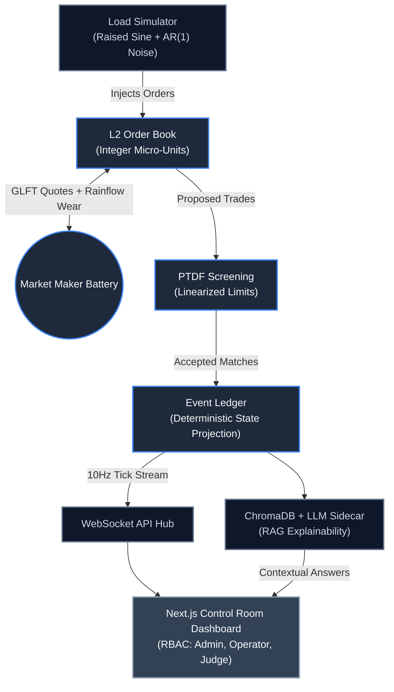

<div align="center">
  <h1 align="center">Sovereign-AMM</h1>
  <p align="center">
    <strong>Deterministic HFT Market Microstructure & Quantitative Energy Matching Engine</strong>
  </p>
  <p align="center">
    
    
    
    
  </p>
  <p align="center">
    <a href="#architecture"><strong>[ Architecture ]</strong></a> &nbsp;&nbsp;|&nbsp;&nbsp;
    <a href="#core-mathematics"><strong>[ Core Math ]</strong></a> &nbsp;&nbsp;|&nbsp;&nbsp;
    <a href="#platform-capabilities"><strong>[ Capabilities ]</strong></a> &nbsp;&nbsp;|&nbsp;&nbsp;
    <a href="#quickstart"><strong>[ Quickstart ]</strong></a>
  </p>
</div>

<br/>

## The System

**Sovereign-AMM** is a deterministic energy matching engine that treats a physical microgrid as a high-frequency financial exchange. By employing rigorous mathematical models, the system eschews non-deterministic predictive AI in favor of robust market microstructure principles. 

In this exchange, households and solar producers post bids and asks for energy (kWh) into an **L2 limit order book**. A central grid battery acts as the algorithmic market maker, continuously quoting a two-sided price utilizing the **Gueant-Lehalle-Fernandez-Tapia (GLFT)** bounded-inventory model, critically augmented with dynamic **Rainflow fatigue costs** to account for physical battery degradation.

**Thesis**: Uncompromising grid stability is achieved through deterministic market microstructure and strict physics constraints.

---

<h2 id="architecture">Architecture</h2>

The system leverages an event-sourced ledger and strict constraint screening to maintain perfect state determinism and O(1) matching efficiency. The platform is wrapped in a secure, role-based Next.js frontend for operators and judges.



---

<h2 id="core-mathematics">Core Mathematics & Microstructure</h2>

Sovereign-AMM strictly adheres to mathematical rigor. Core components include:

- **GLFT Pricing Model**: The market maker computes optimal bid-ask spreads dynamically based on inventory levels, shielding against inventory risk while maintaining liquidity.
- **Rainflow Cycle Counting**: Physical battery degradation is priced into the spread using a streaming 3-point cycle counting algorithm. Every reversal and closed cycle contributes directly to marginal wear cost ($C_{deg}$).
- **Power Transfer Distribution Factors (PTDF)**: Trades are validated against physical transmission limits in sub-milliseconds, ensuring that localized matching never violates global grid constraints.
- **Micro-price Referencing**: The mid-price is dynamically adjusted based on order book imbalance, providing a more accurate reference price for the market maker.

---

<h2 id="platform-capabilities">Platform Capabilities & Modules</h2>

The system exposes a comprehensive suite of real-time operator interfaces and observability tools.

<table width="100%">
  <thead>
    <tr>
      <th align="left">Module</th>
      <th align="left">Description & Implementation Details</th>
    </tr>
  </thead>
  <tbody>
    <tr>
      <td><strong>Live Grid Topology</strong></td>
      <td>Real-time microgrid map visualizing power flow direction, per-line loading, and thermal limits. PTDF-based congestion is computed instantly, highlighting congested lines and blocking unsafe trades.</td>
    </tr>
    <tr>
      <td><strong>GLFT Pricing Waterfall</strong></td>
      <td>Live decomposition of the pricing algorithm: micro-price &rarr; inventory adjustment &rarr; risk adjustment &rarr; degradation cost &rarr; final bid/ask spread.</td>
    </tr>
    <tr>
      <td><strong>Battery Degradation Monitor</strong></td>
      <td>Live State-of-Charge (SoC) graph bounded by physical walls. Streams Rainflow cycle counts to compute accumulated wear and marginal degradation cost (C_deg) in real time.</td>
    </tr>
    <tr>
      <td><strong>Simulated Settlement Ledger</strong></td>
      <td>Tracks user energy consumption and solar generation. Replaces fiat banking with simulated monthly net settlements formatted to NPCI bulk-NEFT standards.</td>
    </tr>
    <tr>
      <td><strong>RAG Explainability Copilot</strong></td>
      <td>Global slide-out drawer allows judges to ask "Why did the price spike?" or "Why was this trade rejected?" Answers strictly cite event-log entries via ChromaDB vector search.</td>
    </tr>
    <tr>
      <td><strong>Interactive Demo Mode</strong></td>
      <td>Pre-seeded deterministic scenarios (Load Spike, Solar Surplus, Low Battery, Grid Congestion) demonstrating system response without requiring raw parameter manipulation.</td>
    </tr>
    <tr>
      <td><strong>Role-Based Access Control</strong></td>
      <td>Secure JWT authentication with Argon2id hashing. Strict segregation of duties across Admin, Grid Operator, Battery Operator, Market Participant, and Viewer/Judge roles.</td>
    </tr>
    <tr>
      <td><strong>Emergency Safety Override</strong></td>
      <td>Operator-only kill switch. Pauses automated trading and battery dispatch while maintaining event log continuity. Triggers site-wide visual alerts.</td>
    </tr>
    <tr>
      <td><strong>System Health & Telemetry</strong></td>
      <td>Live status and latency metrics for the L2 Order Book, GLFT Engine, PTDF Engine, and WS Hub. Includes a live-tailing view of the raw event stream for auditability.</td>
    </tr>
  </tbody>
</table>

---

<h2 id="recent-updates">Recent Updates</h2>

- **Persistent Backend Storage**: Migrated ledger and tick data to robust local SQLite storage (`storage.py`) for enhanced data durability across sessions.
- **Enhanced Security Core**: Centralized JWT authentication and Argon2id hashing within the dedicated `security.py` module to enforce strict Role-Based Access Control (Admin, Operator, Judge).
- **Expanded City Simulation**: Introduced robust mock data generators (`city_data.py`, `seed_history.py`) to seed complex virtual city topologies and history for realistic local testing.

---

<h2 id="quickstart">Quickstart</h2>

Local development (Python ≥ 3.11, Node 20):

```bash
# 1. Install engine, API and frontend dependencies
make install

# 2. Seed 24 h of history (86,400 ticks) into backend/app/db/sovereign.db
make seed

# 3. Start the FastAPI engine on :8000 (10 Hz tick loop starts automatically)
make backend

# 4. In another terminal, start the Next.js dashboard on :3000
make frontend

# 5. Run the test suites
make test            # 58 pytest cases: engine math + API/WebSocket/DuckDB + playback + trading
make test-frontend   # 953 vitest cases
cd frontend && npm run build
```

Or everything at once with Docker: `make dev` (`docker compose up --build`).

### Live data path

| Stream / endpoint | Rate | Feeds |
|---|---|---|
| `ws://…/ws/orderbook/demo` | 10 Hz | L2 depth (12 × 12), micro-price, OBI, tape, AMM quotes, SoC, PnL |
| `ws://…/ws/grid/demo` | 1 Hz | 9 line flows (`f = PTDF · p`), LMP decomposition, 9 × 7 PTDF, rainflow histogram, GLFT risk params |
| `GET /history/demo?window=24H` | REST | DuckDB 1-minute columnar rollups over the 86,400-point history (1H/4H return raw ticks) |
| `POST /api/control/inject` · `POST /api/control/inject/csv` | REST | Custom datasets (ticks / orders / bus injections / SoC / parameters) — every connected dashboard re-hydrates |
| `POST /api/auth/demo` | REST | Guest Demo Session token (auto-started by the frontend; Google OAuth / password sign-in still available) |

| `POST /api/simulation/upload-csv` · `GET /api/simulation/status` | REST | Custom 24 h dataset (`timestamp, bus_id, house_count, solar_mw, demand_mw, micro_price, battery_soc_pct, grid_frequency_hz`, 10 s rows) — playback is matched to the wall clock (`SIM_TIMEZONE`, default IST) so 08:00 streams the 08:00 row |
| `POST /api/trading/orders` · `GET /api/trading/portfolio` · `ws://…/ws/user/{id}` | REST + WS | Household trading terminal: market / limit / auto-charge orders against the Central Power Control AMM, live fills, PnL and savings vs utility tariff |

Generate the built-in sample dataset (also produced automatically at startup): `python simulation/generators/generate_demo_csv.py` → `simulation/data/sample_24h_microgrid.csv` (8,640 rows, 100 homes + 5 MWh hub).

The frontend keeps every widget on a single Zustand store (`frontend/lib/store.ts`). When the backend is unreachable the dashboards fall back to the seeded in-browser simulation and show a `SIMULATED` pill instead of `LIVE · 10 Hz`.

> **Note**: The engine strictly enforces pure math in `engine/core`. No floating point operations for ledger accounting, and no network/I/O calls within the matching logic.
